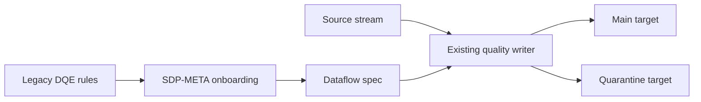
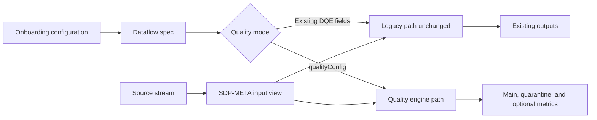
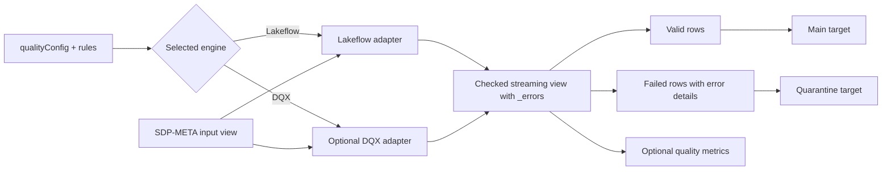

# Product Requirements Document: SDP-META Quality Engines

## Document status

- Status: Draft
- Product: SDP-META
- Scope: Native Lakeflow quarantine correctness and optional DQX integration
- Source plan: `NATIVE_DQE_QUARANTINE_FIX_PLAN.md`
- Delivery model: Two independently releasable increments

## Executive summary

SDP-META supports Lakeflow expectations through metadata-driven onboarding,
but its current quarantine path has behavior and documentation gaps:

- quarantine rules use legacy invalid-predicate semantics;
- customers must duplicate inverse rules to remove invalid rows from the main
  target;
- multiple quarantine predicates do not provide intuitive any-failure routing;
- quarantine rows do not contain the documented failure details;
- a quarantine-only specification can omit the main target entirely; and
- an empty quarantine target silently disables quarantine.

Existing customer configurations must continue to work without modification.
Therefore, SDP-META will preserve the current DQE path as a permanent legacy
mode and introduce a separate, additive quality-engine configuration.

The first delivery adds a corrected native Lakeflow engine. The second adds an
optional Databricks Labs DQX engine behind the same output contract.

## Problem statement

### Customer problem

Customers need metadata-driven quality enforcement that:

- evaluates rules directly on the pipeline DataFrame;
- writes accepted records to the main target;
- preserves rejected records in a configured quarantine target;
- explains which rules each quarantined record failed;
- produces reliable metrics;
- works consistently with JSON and YAML onboarding; and
- does not require rewriting existing SDP-META rule files.

Today, customers cannot get all of these properties from the existing
`expect_or_quarantine` implementation.

### Product problem

SDP-META currently mixes three concerns in `write_layer_with_dqe()`:

- native expectation decoration;
- main-target declaration; and
- custom quarantine routing.

This makes behavior difficult to reason about and prevents a clean optional
integration with DQX. The current single-DataFrame custom-transform contract is
also insufficient for declaring valid, quarantine, and metrics outputs.

## Current and proposed state

### Current state

The legacy path reads one source view but treats main and quarantine rules
differently. Customers commonly duplicate inverse predicates across
`expect_or_drop` and `expect_or_quarantine`. The quarantine writer keeps rows
where its invalid-condition expression evaluates to true.



Current consequences:

- `expect_or_quarantine` must describe invalid data.
- Invalid rows remain in the main target unless inverse drop rules exist.
- Multiple quarantine rules use all-of behavior.
- Quarantine rows have no structured `_errors`.
- A quarantine-only spec can omit the main target.
- An empty quarantine target silently skips quarantine.

### Proposed state

The proposed model keeps the legacy path unchanged for existing configurations
and adds explicit Lakeflow and DQX engines. Both new engines produce a checked
streaming view and use the same main/quarantine writer contract.

#### Compatibility overview



#### Quality engine processing



The new path applies quality rules inside the same Lakeflow pipeline. It does
not require a separate post-pipeline notebook or external table reread.

## Product principles

1. No silent reinterpretation of existing customer rules.
2. Existing valid configurations require no changes.
3. New behavior is explicitly selected per layer.
4. Rules are evaluated on the SDP-META pipeline DataFrame, not in a separate
   post-pipeline batch job.
5. Native Lakeflow and DQX remain distinct engines with a common routing
   contract.
6. DQX remains optional and is never imported for native-only pipelines.
7. Unsupported combinations fail before data is silently misrouted.

## Goals

### Deliverable A: native Lakeflow quality engine

- Preserve the existing DQE path and its rule-file meaning.
- Correct the quarantine-only main-table declaration bug.
- Fail clearly when quarantine rules have no usable target.
- Add an opt-in Lakeflow engine using valid predicates.
- Route any failed quarantine rule to quarantine.
- Add structured `_errors` details to quarantined records.
- Preserve native Lakeflow expectation metrics.
- Support Bronze and Silver standard flows.
- Provide JSON and YAML examples, tests, and accurate documentation.

### Deliverable B: optional DQX quality engine

- Apply DQX checks directly to the SDP-META pipeline DataFrame.
- Use DQX-native valid and invalid routing.
- Preserve DQX `_errors` and `_warnings`.
- Optionally publish DQX metrics.
- Keep DQX out of the default SDP-META dependency set.
- Reuse the same onboarding fields and target configuration as the Lakeflow
  engine.

## Non-goals

- Changing the meaning of existing
  `*_data_quality_expectations_json_{env}` fields.
- Automatically migrating or rewriting customer rule files.
- Inferring whether an existing expression describes valid or invalid data.
- Replacing native Lakeflow expectations with DQX.
- Making DQX a mandatory SDP-META dependency.
- Claiming new-engine support for CDC, snapshots, append flows, or multi-source
  CDC before each mode has executable integration coverage.
- Supporting all DQX features in the first DQX release.

## Personas

### Data engineer

Wants to define quality rules in source control and deploy repeatable Bronze
and Silver pipelines without custom orchestration.

### Data platform engineer

Wants consistent target naming, permissions, metrics, dependency management,
and rollout behavior across teams.

### Data quality owner

Wants rejected rows to include actionable rule details and, when using DQX,
access to richer checks, warnings, metrics, and alerting.

### Existing SDP-META customer

Wants upgrades to preserve current pipelines and rule behavior without editing
configuration.

## User stories

1. As an existing customer, I can upgrade SDP-META and run my current DQE
   configuration without changing its rules.
2. As an existing customer with a quarantine-only spec, I receive both the
   main and quarantine targets after the bug fix.
3. As an operator, I receive a clear onboarding or runtime error when rules
   request quarantine but no quarantine target is configured.
4. As a data engineer, I can select the new Lakeflow engine and define every
   rule as a valid-data predicate.
5. As an investigator, I can identify every failed rule on each quarantined
   record.
6. As a platform engineer, I can use existing quarantine table, path,
   clustering, partitioning, property, and row-filter settings with either new
   engine.
7. As a DQX customer, I can reference DQX JSON or YAML checks and have them
   applied within the same Lakeflow pipeline.
8. As a native-only customer, I do not install or load DQX.

## Configuration model

### Legacy mode

Existing configuration remains unchanged:

```yaml
bronze_data_quality_expectations_json_prod: /Volumes/catalog/config/dqe/customers.yml
bronze_quarantine_table: customers_quarantine
```

Legacy mode is selected when `dataQualityExpectations` exists and the new
layer-specific quality engine is absent.

### New Lakeflow mode

```yaml
bronze_quality_engine: lakeflow
bronze_quality_rules_path_prod: /Volumes/catalog/config/quality/customers.yml
bronze_quarantine_table: customers_quarantine
```

### New DQX mode

```yaml
bronze_quality_engine: dqx
bronze_quality_rules_path_prod: /Volumes/catalog/config/dqx/customers.yml
bronze_quarantine_table: customers_quarantine
bronze_quality_metrics_table: customers_quality_metrics
```

Silver uses the equivalent `silver_*` fields.

### Existing quarantine target fields

The new engines reuse existing fields:

- `*_catalog_quarantine_{env}`
- `*_database_quarantine_{env}`
- `*_quarantine_table`
- `*_quarantine_table_path_{env}`
- `*_quarantine_table_properties`
- `*_quarantine_table_partitions`
- `*_quarantine_table_cluster_by`
- `*_quarantine_table_cluster_by_auto`
- `*_quarantine_row_filter`

SDP-META must not introduce a duplicate `*_quality_quarantine_*` hierarchy.

### Lakeflow rules-file schema

The new Lakeflow rules file supports four groups. Every expression describes
valid data:

```yaml
expect:
  region_present: region IS NOT NULL
expect_or_drop:
  parse_succeeded: _rescued_data IS NULL
expect_or_fail:
  source_id_present: source_id IS NOT NULL
expect_or_quarantine:
  valid_id: id IS NOT NULL
  positive_amount: amount > 0
```

### DQX rules-file schema

DQX mode consumes DQX-native metadata:

```yaml
- name: customer_id_required
  criticality: error
  check:
    function: is_not_null
    arguments:
      column: customer_id
```

## Rules lifecycle

1. Customers maintain rules in Git beside onboarding configuration.
2. DAB or another deployment process stages the rules to a UC Volume.
3. SDP-META onboarding loads and validates the engine-specific file.
4. Onboarding stores a nullable `qualityConfig` in the dataflow-spec row.
5. `qualityConfig` contains:
   - engine;
   - serialized validated rules;
   - original source path;
   - content hash;
   - output targets; and
   - engine-specific options.
6. Pipeline execution uses the embedded snapshot so a mutable external file
   cannot change rules midway through an update.

Old dataflow-spec rows deserialize with `qualityConfig = null`.

## Runtime selection

Runtime dispatch is explicit:

```python
if dataflow_spec.qualityConfig:
    write_with_quality_engine(dataflow_spec.qualityConfig)
elif dataflow_spec.dataQualityExpectations:
    write_layer_with_dqe()
else:
    write_standard_table()
```

Onboarding rejects any row that mixes a legacy DQE field with a new
layer-specific quality engine.

## Pipeline behavior

### Common topology

```text
SDP-META input view
  -> selected quality engine
  -> checked temporary view
      -> main target
      -> quarantine target
      -> optional metrics target
```

Each quality-enabled flow adds one `dp.temporary_view`. Both target tables read
that checked streaming view. There is no separate notebook, external
materialization, or second source definition.

### Main target

The main target:

- keeps `expect` rows while recording metrics;
- drops `expect_or_drop` failures;
- stops the update for `expect_or_fail` failures;
- drops `expect_or_quarantine` failures;
- does not expose `_errors`; and
- retains existing table options and row filters.

For new Lakeflow-mode quarantine rules, the main target uses
`dp.expect_all_or_drop` so violations remain visible in native event-log
metrics.

### Quarantine target

The quarantine target:

- contains rows where any quarantine rule failed;
- preserves structured `_errors`;
- retains all source columns;
- uses the configured catalog, schema, table, path, properties, partitions,
  clustering, automatic clustering, and row filter; and
- fails clearly when no target is configured.

Recommended diagnostic schema:

```text
_errors ARRAY<STRUCT<
  name: STRING,
  expression: STRING
>>
```

### Null and deterministic expression handling

Every new Lakeflow predicate is converted to:

```text
COALESCE((customer_expression), FALSE)
```

The same normalized string is used for `_errors` and the native expectation
decorator. New Lakeflow mode rejects non-deterministic expressions so routing
and event-log metrics cannot diverge between evaluations.

### Dedicated readers

The new quality path uses dedicated main and quarantine readers. It does not
change the shared legacy `write_to_delta()` reader.

Conceptually:

```python
def read_quality_main():
    return dp.read_stream(checked_view).drop("_errors")

def read_quality_quarantine():
    return dp.read_stream(checked_view).where(size("_errors") > 0)
```

## Functional requirements

### Deliverable A

- FR-A1: Existing legacy rule files retain their current meaning.
- FR-A2: A legacy spec containing only `expect_or_quarantine` declares both
  the main target and configured quarantine target.
- FR-A3: Missing or empty quarantine targets fail onboarding.
- FR-A4: Persisted invalid specs that bypass onboarding fail at runtime.
- FR-A5: Onboarding accepts `lakeflow` for Bronze and Silver.
- FR-A6: Onboarding validates the four-group Lakeflow rules schema.
- FR-A7: Onboarding persists nullable `qualityConfig`.
- FR-A8: Runtime explicitly dispatches standard, legacy, and new quality paths.
- FR-A9: Any failed quarantine rule routes a row to quarantine.
- FR-A10: Quarantined rows identify every failed rule.
- FR-A11: SQL `NULL` rule results are failures.
- FR-A12: Native event-log metrics remain available.
- FR-A13: Existing quarantine target options remain functional.
- FR-A14: Mixed legacy and new quality configuration is rejected.
- FR-A15: Bronze and Silver standard flows are supported and tested.
- FR-A16: Current CDC legacy behavior is protected by golden tests.

### Deliverable B

- FR-B1: Onboarding accepts `dqx` for Bronze and Silver.
- FR-B2: DQX metadata is validated during onboarding.
- FR-B3: DQX checks execute on the SDP-META pipeline DataFrame.
- FR-B4: DQX valid and invalid routing uses DQX-native semantics.
- FR-B5: DQX `_errors` and `_warnings` are preserved where applicable.
- FR-B6: DQX metrics are written only when configured.
- FR-B7: DQX is imported only for DQX-enabled flows.
- FR-B8: Missing DQX dependencies produce an actionable installation error.
- FR-B9: Native-only pipelines do not require DQX.

## Non-functional requirements

- NFR-1: No additional external table scan or post-pipeline batch job.
- NFR-2: JSON and YAML configurations produce equivalent dataflow specs.
- NFR-3: A second pipeline update is idempotent.
- NFR-4: Rule snapshots are auditable through path and content hash.
- NFR-5: Unsupported source modes fail before writing partial output.
- NFR-6: New fields remain nullable for backward-compatible deserialization.
- NFR-7: Error messages identify the flow, layer, engine, and missing or
  invalid field.
- NFR-8: DQX dependency resolution is isolated from native-only installs.

## Backward compatibility

The existing `expect_or_quarantine` key remains permanent legacy behavior.
SDP-META will not infer, normalize, migrate, deprecate, or eventually reinterpret
its predicates.

Two intentional corrections are allowed and must be documented:

1. Quarantine-only legacy specs gain the main target that was previously
   missing.
2. Missing quarantine targets fail clearly instead of silently skipping
   quarantine.

Golden fixtures protect standard, quarantine-only, CDC, Bronze, and Silver
legacy behavior. Any broader semantic change requires explicit approval as a
breaking change.

## Source-mode support

### Required for Deliverable A

- Bronze standard flows
- Silver standard flows
- Unity Catalog targets
- Legacy publishing mode
- Declarative Pipeline publishing mode
- Path-based non-UC targets
- Main and quarantine row filters

### Existing behavior to preserve

Legacy CDC invokes AUTO CDC for the main target and applies quarantine against
the raw input view. Tests must capture current table contents before refactoring.

### Deferred until separately proven

- New-engine CDC
- Snapshot flows
- Append flows
- Multi-source CDC

Onboarding must reject new-engine use for a deferred mode.

## Documentation requirements

Documentation must accurately state:

- legacy rules describe invalid quarantine predicates;
- new Lakeflow rules describe valid predicates;
- failing legacy quarantine rows may remain in the main target unless separate
  drop rules exist;
- multiple legacy quarantine rules use all-of behavior;
- SQL `NULL` handling for each mode;
- exact `_errors` and DQX diagnostic schemas;
- quarantine names come from `bronze_quarantine_table` or
  `silver_quarantine_table`;
- quarantine names are not automatically derived as
  `<target_table>_quarantine`;
- `expect_or_drop` drops rows and never routes them to quarantine;
- supported and deferred source modes; and
- how to opt into a new engine without modifying legacy rules.

## UX and validation requirements

Onboarding must produce actionable errors for:

- mixed legacy and new engine fields;
- unsupported engine names;
- unreadable rule files;
- malformed engine-specific rules;
- duplicate rule names;
- missing quarantine targets;
- non-deterministic Lakeflow expressions; and
- unsupported source modes.

Errors must be raised before pipeline deployment whenever the configuration is
available during onboarding. Runtime repeats critical validation for persisted
rows that could bypass current onboarding.

## Dependency model

Deliverable A introduces no new third-party dependency.

Deliverable B exposes DQX as an optional extra:

```bash
pip install "databricks-labs-sdp-meta[dqx]"
```

Pipeline and DAB configuration must include the compatible pinned DQX version
only when a DQX engine is selected.

## Testing requirements

### Golden compatibility tests

- Existing legacy standard output remains unchanged.
- Quarantine-only legacy configuration declares both targets.
- Existing CDC main/quarantine behavior remains unchanged.
- Existing Bronze and Silver fixtures preserve contents and metrics.
- Old rows deserialize with `qualityConfig = null`.
- Mixed legacy/new fields fail.
- Empty Bronze and Silver quarantine targets fail.

### Unit tests

- Four-group rules parsing.
- Deterministic-expression validation.
- Null-safe expression construction.
- Multiple failed-rule diagnostics.
- Stable `_errors` ordering.
- Explicit runtime dispatch.
- Dedicated main/quarantine readers.
- Optional DQX import guard.

### Spark behavior tests

- Passing rows appear only in main.
- Any quarantine failure routes the row to quarantine.
- Multiple failures produce multiple `_errors`.
- `NULL` results fail.
- Main output omits `_errors`.
- Quarantine output preserves `_errors`.
- Drop, warn, and fail groups retain expected behavior.

### Serverless integration tests

Use deterministic input:

```text
8 source rows
5 valid rows
3 quarantine rows
at least 1 row failing multiple rules
```

Validate contents and diagnostics, not only counts. Confirm native metrics and
idempotent second updates for JSON and YAML, Bronze and Silver.

### DQX tests

- Validate and snapshot DQX metadata.
- Apply DQX to a streaming DataFrame.
- Verify DQX valid, invalid, warning, and error semantics.
- Verify optional metrics.
- Verify missing-dependency errors.
- Verify native mode does not import DQX.

## Rollout plan

### Release A: native quality foundation

1. Pin legacy behavior with golden tests.
2. Correct quarantine-only main-target declaration.
3. Add onboarding and runtime missing-target validation.
4. Add nullable `qualityConfig` and explicit dispatch.
5. Add Lakeflow onboarding fields and rule validation.
6. Add the common writer and Lakeflow engine.
7. Add `_errors`, routing, and native metrics.
8. Publish corrected documentation and examples.
9. Run full compatibility and serverless validation.

### Release B: optional DQX engine

1. Accept DQX in the existing engine fields.
2. Add DQX validation and adapter.
3. Add optional packaging and dependency guard.
4. Add DAB and App enablement.
5. Add a same-pipeline DQX example.
6. Run DQX serverless and compatibility validation.

## Success criteria

- Zero required edits for existing valid customer configurations.
- Golden legacy suites pass without unexplained output changes.
- All invalid target configurations fail before silent data loss.
- New Lakeflow tests prove correct any-failure quarantine routing.
- Quarantined records identify all failed rules.
- Native expectation metrics match routed failures.
- Native-only installation and startup do not import DQX.
- DQX-enabled pipelines create valid and quarantine outputs in the same
  Lakeflow pipeline.
- Documentation examples match executable tests.

## Risks and mitigations

### Risk: compatibility regression

Mitigation: permanent legacy dispatch, nullable fields, and golden output tests.

### Risk: metrics and routing diverge

Mitigation: use identical null-safe deterministic expressions for diagnostics
and decorators; reject non-deterministic Lakeflow predicates.

### Risk: source-mode behavior is assumed rather than proven

Mitigation: reject new-engine configurations for deferred modes until
executable tests exist.

### Risk: DQX dependency churn

Mitigation: optional extra, compatible version pin, isolated import, and
serverless integration tests.

### Risk: configuration complexity

Mitigation: one engine selector and one rules path per layer while reusing all
existing quarantine target fields.

### Risk: rules change after onboarding

Mitigation: persist validated rule content and hash in `qualityConfig`.

## Open questions

1. Should the new Lakeflow engine expose `_warnings` as well as `_errors`?
2. Should DQX metrics use an existing configured table or a new
   `*_quality_metrics_table` field?
3. What exact DQX version range is supported by each SDP-META release?
4. Should new-engine support initially reject all CDC modes or support the
   current raw-input quarantine topology?
5. Should `qualityConfig` retain the full original rules document in addition
   to normalized rules?
6. What maximum rules-document size should onboarding allow?
7. Should the Databricks App render engine-specific rule editors or initially
   expose only file-path fields?

## Release decision gates

### Deliverable A is ready when

- backward compatibility and Spark routing tests pass;
- the quarantine-only and missing-target defects are corrected;
- Lakeflow mode works for Bronze and Silver standard flows;
- native metrics match routing;
- JSON/YAML and both publishing modes pass; and
- documentation matches observed runtime behavior.

### Deliverable B is ready when

- Deliverable A is released or independently approved;
- DQX is optional and dependency-compatible;
- DQX runs in the same pipeline rather than a separate batch job;
- valid, quarantine, warnings, errors, and optional metrics are verified; and
- native-only behavior remains unchanged.
