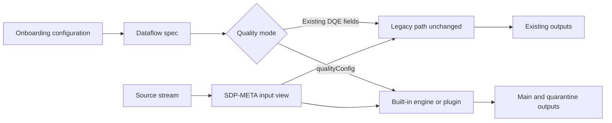
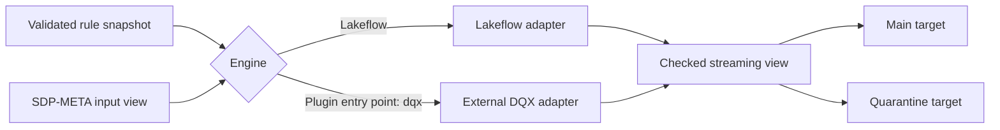

# Proposal: Metadata-Driven Quality Engines for SDP-META

## Status

- **State:** Draft for discussion
- **Audience:** SDP-META maintainers, contributors, and users
- **Scope:** Native Lakeflow quarantine correction, a quality-engine plugin
  SPI, and an optional reference DQX adapter
- **Delivery:** Two independently releasable increments

## Executive summary

SDP-META already supports metadata-driven Lakeflow expectations, but its
legacy `expect_or_quarantine` path has unintuitive behavior:

- quarantine expressions describe invalid data while other expectations
  describe valid data;
- invalid rows can remain in the main target unless customers duplicate the
  inverse rule under `expect_or_drop`;
- multiple quarantine rules use all-of behavior instead of quarantining on any
  failure;
- quarantine rows do not identify the failed rules;
- a quarantine-only configuration can omit the main target; and
- an empty quarantine target silently disables quarantine.

Changing the meaning of existing rules would break customers. This proposal
therefore preserves legacy semantics and adds an explicit, opt-in
quality-engine configuration:

1. **Lakeflow engine:** valid-data predicates, correct quarantine routing,
   structured errors, and native expectation metrics.
2. **Quality-engine plugin SPI:** a stable extension boundary for external
   engines.
3. **Reference DQX adapter:** an optional, separately versioned plugin that
   delegates native DQX rules and APIs to Databricks Labs DQX.

The built-in Lakeflow engine and external plugins run directly on the
SDP-META pipeline DataFrame and use a shared SDP-META writer for main and
quarantine targets. They do not require a post-pipeline notebook or external
table reread. SDP-META core does not translate DQX rules or wrap individual
DQX features.

## Proposed decisions

Reviewers are asked to approve or amend these seven positions:

1. **Compatibility model:** never reinterpret legacy predicates. Legacy
   implementation can be removed only in a future major release after
   deprecation, migration tooling, and explicit migration guidance.
2. **Release A scope:** ship the two legacy corrections and new Lakeflow engine
   together. Implement the quarantine-only main-table correction as a separate,
   revertible commit with its own release-note entry.
3. **Plugin SPI:** prove the private shape in Release A. All engines, including
   built-in Lakeflow, supply decorators only through
   `native_expectations()`. At the start of Release B, publish the unchanged
   shape as experimental `1-beta` so separate repositories can implement it.
   Promote it to stable `1` only after the contract kit passes with DQX and at
   least one non-DQX synthetic plugin.
4. **Adapter ownership:** maintain the DQX adapter in a separate repository and
   release cycle. SDP-META owns it initially; shared ownership begins only
   after a written commitment from DQX maintainers. Do not ship without named
   owners.
5. **DQX warnings:** preserve DQX-native semantics, including warning-only
   overlap between valid and quarantine outputs. Document a warning-only
   filter for customers who want disjoint downstream datasets.
6. **DQX UI:** expose diagnostic tables only in the first adapter release. Do
   not add an aggregate native expectation unless user demand justifies an
   adapter-owned option.
7. **Source modes:** support standard Bronze and Silver only in Release A and
   reject other new-engine modes explicitly. Evaluate append flows next. Defer
   CDC and snapshot until the project decides whether quality runs before or
   after AUTO CDC.

## Current behavior and defects

`DataflowPipeline.write_layer_with_dqe()` reads four rule groups:

- `expect`
- `expect_or_drop`
- `expect_or_fail`
- `expect_or_quarantine`

The main target applies the first three groups but does not apply
`expect_or_quarantine`. The quarantine target independently reads the same
input view and applies `dp.expect_all_or_drop` to the quarantine expressions.

Existing fixtures consequently use inverse predicates:

```yaml
expect_or_drop:
  valid_id: id IS NOT NULL

expect_or_quarantine:
  quarantine_rule: id IS NULL
```

This has several consequences:

1. Existing quarantine rules must describe invalid records.
2. The same condition is often maintained twice in inverse forms.
3. A row enters quarantine only when all quarantine predicates evaluate true.
4. A row can remain in the main target and also appear in quarantine.
5. Quarantine output has no structured list of failed rules.
6. SQL `NULL` behavior is not expressed consistently.
7. Quarantine-only specifications can fail to declare the main target.
8. Missing target names are logged and skipped instead of rejected.
9. Legacy CDC writes the main target through AUTO CDC but quarantines from the
   raw input view.

These behaviors must be documented and protected by golden tests before
refactoring.

## What the prototype DQX demo proved

A prototype (kept on the `issue_435` branch, not merged) ran:

```text
onboarding
  -> SDP-META Bronze pipeline
  -> separate DQX notebook task
  -> validation
```

It proved that:

- SDP-META output can be checked with DQX metadata from JSON or YAML;
- DQX can produce valid and quarantine outputs with `_errors` and `_warnings`;
- DQX can run on serverless compute when its dependency is explicitly
  installed; and
- deterministic tests can validate error and warning routing.

It was useful as a compatibility demonstration, but it is not the desired
product architecture and is not shipped. The extra task rereads the Bronze table after the
pipeline has completed, adds orchestration and latency, and separates quality
results from the pipeline that produced the data.

The proposed reference adapter moves DQX rule evaluation into the same
Lakeflow pipeline and applies it to the DataFrame already produced by the
SDP-META reader and custom transformations. The adapter, rather than
SDP-META core, owns DQX API compatibility.

## Design principles

1. Never silently reinterpret an existing customer rule.
2. Existing valid configurations require no edits.
3. New semantics are selected explicitly per layer.
4. Evaluate quality on the in-pipeline DataFrame.
5. Keep rule evaluation separate from table declaration.
6. Reuse existing main and quarantine target configuration.
7. Keep the built-in Lakeflow engine and external plugins behind one stable
   output contract.
8. Treat plugin rule documents as opaque engine-owned metadata.
9. Discover plugins without importing them during native-only execution.
10. Version the DQX adapter independently from SDP-META core and DQX.
11. Reject unsupported combinations before writing partial output.
12. Snapshot validated rules so mutable files cannot alter a running update.

## Proposed architecture

### Compatibility overview



### New quality-engine path



The checked view is a Lakeflow temporary view, not an externally materialized
table. Lakeflow owns execution, checkpointing, and downstream fan-out.
The initial Lakeflow engine reports through native expectation event-log
metrics; it does not introduce a separate Lakeflow metrics table.

## Runtime modes

Runtime repeats the mixed-configuration guard because dataflow-spec tables can
be edited directly or populated by older onboarding code:

```python
if dataflow_spec.qualityConfig and dataflow_spec.dataQualityExpectations:
    raise InvalidQualityConfiguration("legacy DQE and qualityConfig cannot be combined")
elif dataflow_spec.qualityConfig:
    write_with_quality_engine(dataflow_spec.qualityConfig)
elif dataflow_spec.dataQualityExpectations:
    write_layer_with_dqe()
else:
    write_standard_table()
```

### Standard mode

Selected when neither legacy DQE fields nor `qualityConfig` is present.
Existing standard writing behavior remains unchanged.

### Legacy DQE mode

Selected when existing `dataQualityExpectations` is populated and
`qualityConfig` is absent.

- Existing rule files retain invalid-predicate quarantine semantics.
- Existing main and quarantine contents remain unchanged except for the two
  targeted defect corrections described below.
- Existing CDC topology remains unchanged.

### New Lakeflow mode

Selected explicitly with `bronze_quality_engine: lakeflow` or
`silver_quality_engine: lakeflow`.

- All expressions describe valid data.
- Any failed quarantine rule routes the row to quarantine.
- Failed rules are recorded in `_errors`.
- The main and quarantine outputs are disjoint.
- Native expectations preserve per-rule pipeline event-log metrics.

### DQX plugin mode

Selected explicitly with `bronze_quality_engine: dqx` or
`silver_quality_engine: dqx`.

- SDP-META resolves `dqx` through the quality-engine plugin registry.
- The separately installed adapter owns DQX API and schema compatibility.
- Rules use DQX-native metadata.
- DQX evaluates the SDP-META pipeline DataFrame.
- DQX-native filtering through `get_main_input()` and `get_invalid()` performs
  routing.
- DQX `_errors` and `_warnings` are retained where applicable.
- SDP-META, not DQX, declares and configures the output tables.
- Unsupported or missing plugins fail with an actionable installation error.
- DQX summary-metrics output is deferred from the first adapter release.

## Configuration

### Existing legacy configuration

```yaml
bronze_data_quality_expectations_json_prod: /Volumes/catalog/config/dqe/customers.yml
bronze_quarantine_table: customers_quarantine
```

This configuration continues through the legacy path.

### New Lakeflow configuration

```yaml
bronze_quality_engine: lakeflow
bronze_quality_rules_path_prod: /Volumes/catalog/config/quality/customers.yml
bronze_quarantine_table: customers_quarantine
```

### New DQX configuration

```yaml
bronze_quality_engine: dqx
bronze_quality_rules_path_prod: /Volumes/catalog/config/dqx/customers.yml
bronze_quarantine_table: customers_quarantine
```

Silver uses equivalent `silver_*` fields.

`dqx` is a plugin registry name, not a DQX implementation built into
SDP-META. The external adapter package registers that name through a Python
entry point. Other plugins can register their own names without changing
SDP-META core.

Onboarding rejects configurations that mix a legacy DQE field with a new
quality engine. Runtime performs the same check for persisted rows that bypass
onboarding. SDP-META never guesses semantics from rule names or expressions.
Duplicate rule names fail onboarding, and rule documents are limited to
1 MiB by default.

### Switching engines on an existing flow

Lakeflow `_errors` uses SDP-META's
`ARRAY<STRUCT<name: STRING, expression: STRING>>` schema. DQX owns its
diagnostic types, and recent versions can use a map-shaped `_errors` column.
Reusing an existing quarantine table after changing engines can therefore
produce an incompatible Delta schema.

This requires a new onboarding capability: before its current MERGE or
overwrite, onboarding reads the existing dataflow-spec row for the same flow
and compares its quality metadata. If no prior row exists, the flow is being
onboarded for the first time and no engine-switch check is performed.

Default behavior:

- onboarding compares the previous engine and diagnostic-schema fingerprint
  for the same flow;
- an engine or diagnostic-schema change cannot silently reuse the same
  quarantine table;
- the customer must configure a new quarantine table name or explicitly
  declare a full-refresh schema migration; and
- the migration choice is stored in `qualityConfig` and surfaced before
  deployment.

The proposed explicit value is
`<layer>_quality_engine_migration: full_refresh`. Without that acknowledgment
or a new target name, onboarding rejects the switch.

## Rule formats and semantics

### New Lakeflow rules

Every expression describes valid data:

```yaml
expect:
  region_present: region IS NOT NULL

expect_or_drop:
  parse_succeeded: _rescued_data IS NULL

expect_or_fail:
  source_id_present: source_id IS NOT NULL

expect_or_quarantine:
  valid_id: id IS NOT NULL
  positive_amount: amount > 0
```

Each predicate is normalized as:

```text
COALESCE((customer_expression), FALSE)
```

Therefore, SQL `NULL` is a failure. A row is quarantined when any normalized
quarantine predicate is false:

```text
quarantine = NOT(rule_1_passes AND rule_2_passes ...)
```

New Lakeflow mode rejects only expressions containing functions that are
intrinsically random or row-identity-dependent, initially `rand`, `randn`,
`uuid`, `shuffle`, and `monotonically_increasing_id`. This is a documented,
versioned function-name denylist.

Time functions such as `current_timestamp` and `current_date` are allowed
because they are stable within one query plan and are common in legitimate
rules. They can still evaluate at different instants across downstream flows,
so onboarding emits a warning when they appear in quarantine rules.

SDP-META cannot prove arbitrary SQL or UDF determinism through private JVM
APIs because those APIs are unavailable in Spark Connect/serverless clients.
The denylist is therefore a narrow guardrail, not a general determinism
guarantee. It applies only to the explicit new mode and is never used to infer
or reinterpret legacy semantics.

### DQX plugin rules

The DQX adapter consumes DQX-native JSON or YAML metadata:

```yaml
- name: customer_id_required
  criticality: error
  check:
    function: is_not_null
    arguments:
      column: customer_id
```

SDP-META stores the original rule document and content hash but does not parse,
normalize, or translate DQX checks into SQL expectations. The adapter passes
the document to the installed DQX version for validation and execution. New
DQX checks therefore work without SDP-META changes as long as the adapter's
supported DQX APIs and diagnostic contracts remain compatible.

### DQX warning semantics

The current demo confirms DQX-native behavior in which a warning-only row can
remain valid and also appear in quarantine. Consequently, valid and quarantine
counts may overlap.

Decision 5 preserves that native behavior rather than creating SDP-META-specific
DQX semantics. Customers that need disjoint downstream datasets can filter the
published quarantine table:

```python
quarantine_df = spark.read.table("catalog.schema.customers_quarantine")

warnings_only = quarantine_df.where(
    "COALESCE(size(_warnings), 0) > 0 "
    "AND COALESCE(size(_errors), 0) = 0"
)

errors_only = quarantine_df.where("COALESCE(size(_errors), 0) > 0")
```

The reference adapter documentation must keep this example aligned with the
diagnostic types of its supported DQX versions.

## Quality-engine plugin SPI

SDP-META core defines a small, versioned service-provider interface. The
built-in Lakeflow engine implements the same behavioral contract internally;
external packages implement it through registered entry points.

```python
class QualityEnginePlugin:
    api_version = "1-beta"
    allows_overlap = False          # True only when main and quarantine may share rows
    overlap_diagnostics = None      # (warning_column, error_column) when allows_overlap

    def validate(self, rules_document, options):
        """Validate engine-owned configuration during onboarding."""

    def apply(self, input_df, rules_document, options):
        """Return a checked DataFrame."""

    def get_main_input(self, checked_df):
        """Return rows presented to the main target's bindings."""

    def get_invalid(self, checked_df):
        """Return rows routed to quarantine by this engine."""

    def native_expectations(self, rules_document, options):
        """Return dataset-scoped native expectation bindings."""

    def reserved_columns(self):
        """Return diagnostic column names produced by this plugin."""
```

`allows_overlap` lets the contract test kit decide which routing assertion to
run: disjoint main and quarantine rows when `False`, or, when `True`, that
every shared row carries a non-empty warning diagnostic and an empty error
diagnostic in the columns named by `overlap_diagnostics`. The built-in
Lakeflow engine declares `False`; the reference DQX adapter declares `True`
with `("_warnings", "_errors")`.

The illustrative entry-point group is:

```text
databricks.labs.sdp_meta.quality_engines
```

An external adapter registers a stable name such as `dqx`. SDP-META resolves
the name with `importlib.metadata.entry_points()` only when that engine is
selected. The final group name and package name require approval before
implementation.

The first externally importable SPI is explicitly experimental `1-beta` and
carries no compatibility promise. After both required implementations pass the
contract kit, stable `1` remains backward compatible throughout its major
version. Breaking changes then require a new SPI major and adapter migration
guidance.

The plugin contract deliberately excludes individual quality functions,
engine-specific rule schemas, and engine-specific feature flags. Those remain
owned by the plugin and its underlying engine.

`native_expectations()` returns bindings containing:

- target dataset: `checked` or `main`;
- action: `expect`, `expect_or_drop`, or `expect_or_fail`; and
- named SQL expressions.

The common writer applies the corresponding `dp.expect_all*` decorators to
the declared dataset. The built-in Lakeflow implementation uses this hook for
per-rule event-log metrics. A DQX adapter can later return one checked-view
aggregate retained expectation without requiring DQX-specific logic in the
writer.

This is the only decorator path: built-in and external engines return
bindings, and only the common writer calls `dp.expect_all*`. No engine may
decorate a dataset directly or require an engine-specific writer branch.

The common SDP-META writer owns:

- main and quarantine table declaration;
- catalogs and schemas;
- table names and paths;
- table properties;
- partitions and clustering;
- automatic clustering;
- row filters; and
- application of plugin-supplied native expectation decorators.

Each plugin owns:

- parsing and validating its native rules;
- invoking its underlying engine;
- defining valid and invalid routing semantics;
- adapting engine-native diagnostic columns to its declared output contract;
- supplying optional native expectation expressions;
- declaring reserved diagnostic columns; and
- publishing its supported engine-version range.

This separation prevents plugins from owning SDP-META table lifecycle while
preventing SDP-META core from tracking every DQX feature or rule change.

### Maintenance boundary

SDP-META core guarantees:

- versioned SPI discovery and invocation;
- immutable storage of opaque rule documents;
- checked-view fan-out and target lifecycle;
- plugin identity and compatibility validation;
- actionable plugin-loading errors; and
- a reusable contract test kit.

SDP-META core does not own:

- DQX rule schemas or check catalogs;
- wrappers for individual DQX features;
- DQX diagnostic schema adaptation;
- certification of every DQX release;
- DQX-specific metrics implementations; or
- DQX-specific native UI bridges.

The reference adapter owns those DQX-specific concerns. A new DQX check or
metadata option should work without an SDP-META release when it passes through
the adapter's existing native DQX API. Only a breaking API, diagnostic schema,
or execution-contract change requires a new adapter release.

### Reserved diagnostic columns

Quality processing runs after SDP-META custom transformations. SDP-META must
not silently overwrite a customer column:

- the built-in Lakeflow engine reserves `_errors`;
- the reference DQX adapter reserves `_errors` and `_warnings`; and
- every external plugin declares its reserved columns through the SPI.

Onboarding rejects collisions when the resolved input schema is available.
Runtime validation always checks the transformed DataFrame immediately before
the plugin adds diagnostics and fails with the flow, layer, engine, and
colliding column names.

## Lakeflow checked-view behavior

The Lakeflow adapter creates one checked temporary view:

```text
source columns + _errors
```

Each failed quarantine rule contributes one deterministic entry:

```text
_errors ARRAY<STRUCT<
  name: STRING,
  expression: STRING
>>
```

The main target:

- keeps rows accepted by `expect`;
- drops `expect_or_drop` failures;
- consumes the checked view after its `expect_or_fail` bindings pass;
- drops `expect_or_quarantine` failures;
- removes `_errors` before publishing; and
- preserves existing table options.

The quarantine target:

- contains rows where any quarantine rule failed;
- preserves every failed rule in `_errors`;
- retains source columns and configured table options; and
- fails clearly if no quarantine target is configured.

`_errors` contains only `expect_or_quarantine` failures. It does not include
ordinary `expect_or_drop` failures.

If a row fails both groups, **quarantine wins for the quarantine branch**:

- it is absent from main because it failed the drop rule and the quarantine
  drop binding; and
- it remains in quarantine because the quarantine branch filters `_errors`
  independently and does not apply ordinary `expect_or_drop` rules.

A row failing only `expect_or_drop` is dropped from main and does not enter
quarantine.

For native metrics, the writer applies the same normalized quarantine
predicates through SPI-supplied `dp.expect_all_or_drop` bindings. This
evaluates those predicates once for `_errors` and again for native metrics.
That internal duplication is intentional; customers maintain each rule only
once.

### `expect_or_fail` with quarantine

The Lakeflow implementation binds `expect_or_fail` to the checked temporary
view through `native_expectations()`, not only to the main target. Main and
quarantine both consume that view, so both downstream evaluations encounter
the same failing expectation and reject their respective batches containing
that row.

Expected behavior: neither target commits a micro-batch containing a row that
fails `expect_or_fail`. Main and quarantine are independent streaming flows
with separate checkpoints and micro-batch boundaries, so previously committed
prefixes remain committed and the two targets can stop at different prefixes.
After the rule or data is corrected, both flows resume from their own
checkpoints.

Serverless tests assert that the failing row is absent from both targets and
that both flows can resume successfully. They do not assert unchanged table
versions or identical committed prefixes.

## DQX adapter and quarantine ownership

DQX does not independently create an SDP-META quarantine table in this design.
Responsibilities are divided as follows:

- The external adapter passes the opaque rule document to DQX.
- DQX applies checks and supplies engine-native diagnostics.
- The adapter exposes valid and invalid DataFrames through the SPI.
- SDP-META declares and writes the configured quarantine target.
- Existing `bronze_quarantine_table` or `silver_quarantine_table` determines
  the target name.

SDP-META does not create one table per DQX rule. One configured quarantine
target receives rows classified as invalid for that dataflow.

## Observability and the Lakeflow Pipelines UI

### Lakeflow engine

New Lakeflow rules use native `dp.expect*` decorators. Their pass, fail, and
drop metrics are therefore available in the pipeline event log and supported
Lakeflow Pipelines UI surfaces.

Metrics parity is scoped to quarantine-rule decorators: each quarantine
rule's failed count must match rows whose `_errors` contain that rule. When
ordinary `expect_or_drop` rules are present, total dataset dropped rows are
not compared with quarantine row count.

### DQX adapter

Official DQX integration with Lakeflow Pipelines uses DQX methods, not native
expectations. Therefore:

- individual DQX checks do not automatically appear as native expectations in
  the Lakeflow Pipelines UI;
- detailed results live in `_errors`, `_warnings`, and quarantine output; and
- the pipeline graph shows the checked, main, and quarantine datasets created
  by the pipeline.

The first adapter release deliberately returns no native expectation bindings.
A single aggregate pass-rate bar would hide rule-level failures and imply UI
parity that the adapter does not provide. Detailed observability remains in
DQX diagnostic outputs, and the release does not claim native per-rule DQX UI
integration.

If users later request an aggregate signal, it can be proposed as an opt-in
adapter feature. Any such bridge remains adapter-owned because it couples to
DQX diagnostics; it is not added to SDP-META core.

### DQX summary metrics are deferred

The SPI does not expose `get_metrics(checked_df)` in version 1. DQX summary
metrics are aggregations, not a simple streaming DataFrame split.

The documented DQX Lakeflow mechanism first persists checked data and then
calls `compute_summary_metrics` from a downstream materialized view. That view
is refreshed as an aggregate over the persisted table. The alternative
`foreachBatch` pattern writes per-batch history outside normal declarative
table ownership. Neither mechanism matches the initial temporary checked-view
topology without adding materialization or new write semantics.

Summary metrics remain deferred until a separate design chooses one of those
mechanisms and specifies refresh, watermark, output-mode, ownership, and
idempotency behavior. Adding metrics later requires an optional SPI capability
or a separate metrics extension; it must not overload `get_main_input()` or
`get_invalid()`.

## Rules lifecycle

1. Customers maintain rules in Git beside onboarding configuration.
2. DAB, the App, or another deployment process stages files to a UC Volume.
3. SDP-META onboarding loads the document and calls the selected engine or
   plugin to validate its native JSON or YAML.
4. Onboarding stores a nullable `qualityConfig` in the dataflow-spec row.
5. `qualityConfig` contains the engine registry name, plugin SPI version,
   plugin package/version, diagnostic-schema fingerprint, opaque rule snapshot,
   source path, content hash, output targets, and engine options.
6. Pipeline execution consumes this snapshot rather than rereading a mutable
   external file during graph evaluation.

Existing dataflow-spec rows deserialize with `qualityConfig = null`.

For the built-in Lakeflow engine, the snapshot stores both the original rule
document and normalized expressions. A normalized expression is the exact
`COALESCE((customer_expression), FALSE)` form used for `_errors` and native
expectation bindings.

The snapshot also records the validation-policy version. Existing snapshots
continue using the policy that accepted them. Re-onboarding uses the current
random-function denylist and can reject a rule accepted by an older policy;
release notes must identify denylist additions and the resulting migration.

### Plugin version drift

Onboarding records the selected plugin package/version, SPI version, and
underlying engine version reported by the plugin. Runtime compares that
fingerprint with the installed plugin before evaluating data.

Recommended default:

- fail when the SPI major version is incompatible;
- fail when the underlying engine is outside the adapter's declared range;
- warn and continue when the adapter version changes within an SPI-compatible
  range; and
- support an opt-in strict setting that requires an exact adapter-version
  match and re-onboarding after every adapter upgrade.

Runtime records the actual adapter and engine versions in update diagnostics.
This avoids forcing every DQX flow through re-onboarding for an adapter patch
while preserving an exact-match option for regulated deployments.

## Existing target fields remain authoritative

The built-in Lakeflow engine and external plugins reuse existing
layer-prefixed quarantine fields:

- `*_catalog_quarantine_{env}`
- `*_database_quarantine_{env}`
- `*_quarantine_table`
- `*_quarantine_table_path_{env}`
- `*_quarantine_table_properties`
- `*_quarantine_table_partitions`
- `*_quarantine_table_cluster_by`
- `*_quarantine_table_cluster_by_auto`
- `*_quarantine_table_comment`
- `*_quarantine_row_filter`

Current Silver onboarding also reads the historical
`silver_quarantine_cluster_by` key after the layer-generic helper reads
`silver_quarantine_table_cluster_by`. The new path uses
`silver_quarantine_table_cluster_by` as canonical. The historical key remains
a legacy alias. Conflict rejection applies only to new quality-engine
configuration. Legacy onboarding preserves its current precedence and behavior
unchanged.

No duplicate `*_quality_quarantine_*` hierarchy is introduced. Quarantine
table names are not automatically derived as `<main_table>_quarantine`.

## Backward compatibility

The legacy `expect_or_quarantine` field and its invalid-predicate semantics are
never reinterpreted. SDP-META will not infer or silently rewrite those rules.
The implementation can be deprecated and removed only in a future major
release that provides migration tooling and explicit migration guidance.

Two narrowly scoped legacy corrections are proposed:

1. A quarantine-only legacy specification declares its previously missing
   main target. This creates a new table in the customer's configured catalog
   on upgrade and is therefore a user-visible behavior change.
2. New onboarding rejects missing or empty quarantine targets. Already
   persisted specifications that bypass onboarding raise a runtime error on
   their next update instead of silently skipping quarantine.

Neither correction changes predicate meaning, but both change observable
upgrade behavior. They require prominent release notes, migration guidance,
and explicit acceptance criteria rather than a blanket zero-change claim.

While the legacy implementation is supported, golden tests protect:

- standard legacy output;
- quarantine-only behavior;
- Bronze and Silver behavior;
- CDC main and quarantine topology;
- table contents and metrics;
- old dataflow-spec deserialization; and
- explicit legacy/new runtime dispatch.

## Initial source-mode support

Release A must support and test:

- Bronze standard flows;
- Silver standard flows;
- Unity Catalog targets;
- path-based non-UC targets;
- legacy and Declarative Pipeline publishing modes; and
- main and quarantine row filters.

Existing CDC behavior remains on the legacy path and is protected by golden
tests.

Release A explicitly rejects new-engine use for:

- CDC;
- snapshot flows;
- append flows; and
- multi-source CDC.

Append flows are the first candidate for a later increment because their
topology can apply one checked view per flow. CDC and snapshot require a
separate decision on whether quality runs before or after AUTO CDC; that choice
changes quarantine semantics for deletes, late records, and out-of-order
events. Release A does not make that decision implicitly.

Onboarding rejects a new engine on every unsupported source mode instead of
silently producing incorrect output.

## Dependency model

Release A adds no third-party dependency.

Release A freezes the engine/writer contract privately while implementing the
built-in Lakeflow engine. Release B first publishes the same shape as
experimental `1-beta`, adds entry-point discovery, and later promotes the
proven shape to stable `1`. It does not add DQX as a core dependency. Users
install a separate adapter package, for example:

```bash
pip install databricks-labs-sdp-meta databricks-labs-sdp-meta-dqx
```

The adapter package name is illustrative until packaging design is approved.
It declares compatible ranges for both SDP-META's SPI and DQX.

SDP-META core imports only the selected plugin entry point. It never directly
imports DQX. A missing plugin, incompatible SPI version, or unsupported DQX
version produces an actionable error identifying the engine, flow, layer, and
required package.

DQX-enabled Pipeline and DAB configuration install a compatible adapter
version. The adapter controls its DQX dependency range.

This creates three independent version lines:

- SDP-META versions the stable SPI and common writer;
- the reference adapter versions its integration implementation; and
- DQX versions checks, metadata, diagnostics, and engine APIs.

SDP-META does not certify every DQX release. Adapter releases publish a tested
compatibility range. New DQX checks require no adapter change when they work
through the existing native metadata and APIs.

## Delivery plan

### Release A: native quality foundation

1. Add golden tests for standard, quarantine-only, CDC, Bronze, and Silver
   legacy paths.
2. Correct the quarantine-only main-target declaration in a separate,
   revertible commit with its own release-note entry.
3. Reject missing Bronze and Silver quarantine targets.
4. Add nullable `qualityConfig` and explicit runtime dispatch.
5. Add Lakeflow onboarding fields and JSON/YAML rule validation.
6. Freeze the private SPI shape, including native expectation and reserved
   column hooks, then build the shared writer and Lakeflow implementation
   against it.
7. Implement valid-predicate routing, `_errors`, and native metrics.
8. Add examples and correct legacy documentation.
9. Run unit, Spark, serverless, and backward-compatibility suites.

Release A is independently useful and must not wait for DQX.

### Release B: plugin SPI and optional reference DQX adapter

1. Publish the Release A SPI shape in an importable experimental module as
   `api_version = "1-beta"` with no compatibility promise. Add entry-point
   discovery, compatibility checks, and actionable errors.
2. Build a plugin contract test kit independent of any specific engine.
3. Implement a non-DQX synthetic plugin and require it to pass the contract
   kit.
4. Build the reference DQX adapter in a separate repository and release cycle.
5. Let the adapter validate DQX-native metadata and declare compatible DQX
   versions.
6. Require the DQX adapter and synthetic plugin to pass before promoting the
   experimental SPI to stable `api_version = "1"`.
7. Assign named SDP-META maintainers before shipping the adapter; add DQX
   maintainers only after written ownership agreement.
8. Add optional DAB and App enablement without adding DQX to core installs.
   The first App experience exposes engine and rule-file fields, not
   engine-specific rule editors.
9. Replace the separate-task demo as the recommended architecture with a
   same-pipeline example.
10. Test DQX error, warning, valid, invalid, and idempotency behavior on
   serverless pipelines.

## Validation strategy

### Golden compatibility tests

- Preserve valid legacy table contents and metrics.
- Verify a quarantine-only legacy configuration declares both targets.
- Preserve current CDC main and raw-input quarantine behavior.
- Verify old rows deserialize with `qualityConfig = null`.
- Reject mixed legacy and new fields.
- Reject hand-edited persisted rows containing both `dataQualityExpectations`
  and `qualityConfig`.
- Reject empty Bronze and Silver quarantine targets.

### Unit tests

- Parse JSON and YAML into equivalent snapshots.
- Validate rule names, expressions, and engine values.
- Reject duplicate rule names and functions on the documented random-function
  denylist.
- Allow common time functions while warning about cross-flow evaluation.
- Preserve the validation-policy version on existing snapshots and apply the
  current denylist only during re-onboarding.
- Build null-safe predicates and stable `_errors`.
- Select standard, legacy, Lakeflow, and plugin paths explicitly.
- Discover only the selected plugin.
- Reject missing plugins and incompatible SPI versions.
- Apply native expectation groups supplied through the SPI without
  engine-specific writer branches.
- Reject collisions with plugin-declared reserved columns.
- Fail incompatible SPI or engine versions, warn on compatible adapter drift,
  and enforce exact matching only in strict mode.
- Reject an engine or diagnostic-schema switch that reuses a quarantine target
  without an explicit full-refresh migration.
- Canonicalize the Silver cluster-by field and reject conflicting alias values
  only for new-engine onboarding; verify legacy precedence remains unchanged.
- Run a reusable contract suite against a synthetic test plugin.

### Spark behavior tests

- Passing Lakeflow rows appear only in main.
- Any quarantine-rule failure routes the row to quarantine.
- Multiple failures create multiple ordered `_errors`.
- SQL `NULL` results fail.
- Main output omits `_errors`.
- Quarantine output preserves diagnostics.
- A row failing both drop and quarantine rules remains in quarantine.
- A row failing only a drop rule does not enter quarantine.
- Checked-view fail bindings prevent either target from committing a batch
  containing the failing row.
- DQX warning and error behavior matches the approved contract.

### Serverless integration tests

Use deterministic data containing valid rows, single-rule failures,
multi-rule failures, SQL `NULL`, DQX errors, and DQX warnings.

Validate:

- row contents, not only counts;
- diagnostic names and expressions;
- native event-log metrics;
- quarantine-rule metric parity when ordinary drop rules are also present;
- absence of an `expect_or_fail` failing row from both targets, allowing
  different previously committed prefixes;
- successful checkpoint recovery after the failing rule or data is corrected;
- JSON/YAML equivalence;
- Bronze/Silver equivalence;
- second-update idempotency;
- native-only startup without loading any plugin;
- DQX adapter compatibility against the minimum, maximum, and selected
  representative versions in its advertised range; and
- pass-through use of newly added DQX checks that require no SPI changes.

## Acceptance criteria

- Existing valid configurations require no edits.
- Legacy rule meanings remain unchanged.
- Runtime rejects persisted rows that combine legacy and new quality
  configuration.
- Quarantine-only legacy specifications declare both targets, and release
  notes warn that an upgrade creates the previously missing main table.
- New onboarding rejects missing quarantine targets; persisted invalid specs
  fail at runtime instead of silently skipping quarantine.
- New Lakeflow rules consistently describe valid data.
- Any failed Lakeflow quarantine rule sends the row to quarantine.
- Rows failing both ordinary drop and quarantine rules remain available in
  quarantine while being absent from main.
- Invalid Lakeflow rows do not remain in the main target.
- Quarantine rows identify every failed rule.
- SQL `NULL` results are treated as failures.
- Inputs containing engine-reserved diagnostic columns fail before those
  columns can be overwritten.
- Switching engines or diagnostic schemas requires a new quarantine target or
  an explicit full-refresh migration.
- Existing target options remain functional.
- Native Lakeflow quality metrics match routed failures.
- The plugin SPI is documented and protected by a contract test kit.
- DQX executes through the external adapter inside the same pipeline without
  an external table reread.
- SDP-META core never imports or depends directly on DQX.
- The reference DQX adapter is installable and releasable independently.
- DQX-native rules are not translated or duplicated by SDP-META.
- DQX-enabled flows create configured main and quarantine outputs.
- DQX UI limitations and warning semantics are documented accurately.
- Unsupported source modes fail clearly.
- Checked-view `expect_or_fail` bindings prevent both dependent targets from
  committing the failing batch; previously committed prefixes may differ.
- Documentation examples are exercised by tests.

## Risks and mitigations

### Compatibility regression

Keep explicit legacy dispatch while the mode is supported and protect it with
output-level golden tests. Removal requires a future major migration.

### Metrics and routing divergence

Use identical null-safe Lakeflow expressions for diagnostics and decorators.
Reject a narrow list of intrinsically random functions, warn on time-dependent
cross-flow rules, document the limits, and test event-log metrics against
routed data.

### DQX semantics differ from Lakeflow semantics

Document the approved warning contract and verify actual row contents. Do not
advertise a uniform disjoint contract unless it is implemented.

### DQX dependency churn

Keep DQX outside SDP-META core. Publish tested compatibility ranges from the
separately versioned adapter and run its serverless matrix independently.

### Plugin contract expansion

Do not add engine-specific methods to the SPI. Pass opaque rule documents and
engine options to plugins, and evolve the SPI only for capabilities shared by
multiple engines.

### Untrusted plugin code

Load only installed entry points selected explicitly by configuration. Treat
plugins as trusted pipeline dependencies and include package identity and
version in the persisted quality configuration.

### Configuration complexity

Expose one engine selector and one rules path per layer while reusing existing
target fields.

### Rules change after onboarding

Persist validated content and a hash in `qualityConfig`.

### Unsupported pipeline topology

Reject new-engine configuration until the topology has an executable routing
test.

## Suggested reviewer response

Please comment with:

- **Overall:** approve all seven proposed decisions / request changes
- **Decision to amend:** number, concern, and replacement wording
- **Blocking concern:** description and suggested alternative

## References

- [SDP-META repository](https://github.com/databrickslabs/dlt-meta)
- [Databricks Labs DQX](https://github.com/databrickslabs/dqx)
- [Applying DQX checks](https://databrickslabs.github.io/dqx/docs/guide/quality_checks_apply/)
- `NATIVE_DQE_QUARANTINE_FIX_PLAN.md`
- `QUALITY_ENGINE_PRD.md`
